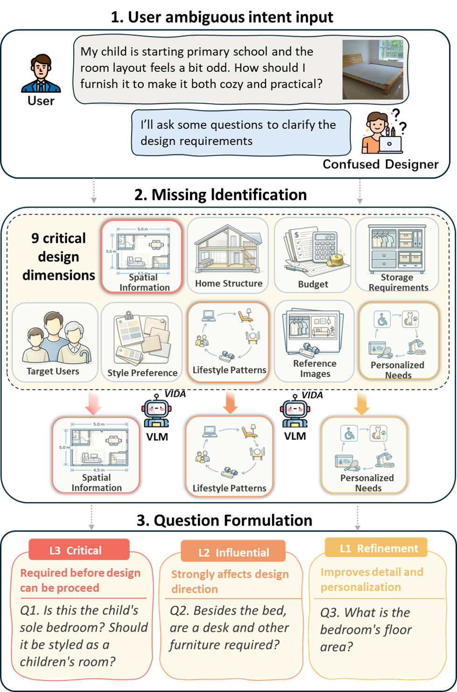
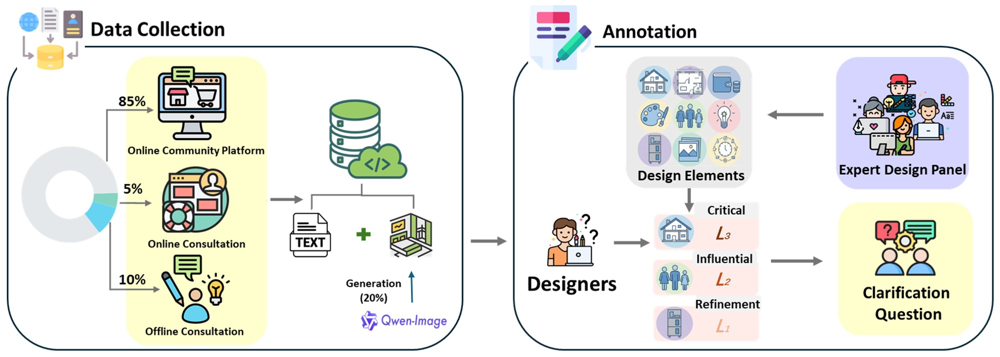

# VIDA: A Visual Intent-driven Design Assistant for Proactive Multimodal Clarification

Official repository for **"VIDA: A Visual Intent-driven Design Assistant for Proactive Multimodal Clarification"**.

VIDA is a multimodal assistant for ambiguous interior-design requests. Given a user query with text and images, VIDA identifies missing design intents and asks clarification questions that are:

- visually grounded
- strategically prioritized
- aligned with professional design practice

The work is built around **InteriorClarify**, a new multimodal benchmark of **1,016 real-world consultation cases** annotated with a three-tier intent hierarchy.

## Highlights

- Proposes VIDA, a proactive multimodal clarification assistant for interior design.
- Builds **InteriorClarify**, a real-world multimodal benchmark with hierarchical intent annotations.

## Problem Setting

Real user requests in interior design are often under-specified. A single request may omit critical constraints such as:

- spatial information
- home structure
- budget
- storage requirements
- target users
- style preference
- lifestyle patterns
- reference images
- personalized needs

VIDA addresses this by first identifying what is missing, then asking the next best clarification question under a three-level priority system:

- `L3 Critical`: required before design can proceed
- `L2 Influential`: strongly affects design direction
- `L1 Refinement`: improves detail and personalization

## Dataset

The benchmark released with this work is **InteriorClarify**.

- Dataset page: [docs/DATASET.md](docs/DATASET.md)
- Size: `1,016` consultation cases
- Modality: text + image
- Domain: interior design clarification
- Annotation target: missing intent dimensions and question-priority hierarchy

The data construction pipeline in the paper combines real consultation sources with expert annotation:

- `85%` online community platform data
- `5%` online consultation data
- `10%` offline consultation data
- additional visual generation support during construction, as illustrated in the paper pipeline

## Contact

For questions about the paper or repository release, please open an issue on GitHub or contact the authors listed in the paper.
